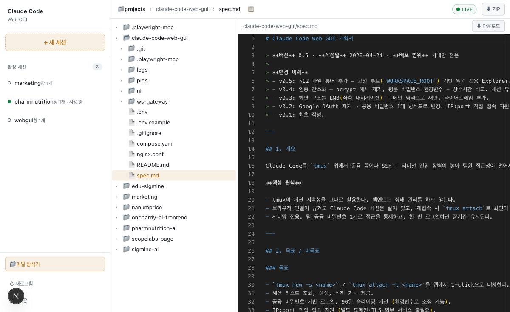

# Claude Code Web GUI

> 브라우저에서 `tmux new` / `tmux attach` 를 한 번에 대체하는 사내용 웹 GUI.
> 터미널은 xterm.js, 파일 탐색은 Monaco 뷰어. 인증은 팀 공용 비밀번호 + iron-session 쿠키.



서버 한 대에 `tmux` 와 Claude Code 를 띄워 놓고, 팀원 누구나 브라우저에서 같은 세션에 붙거나 새로 만든다. SSH 도, 로컬 tmux 설치도, 별도 사용자 계정도 필요 없다. v0.5 부터는 `WORKSPACE_ROOT` 를 뿌리로 하는 **읽기 전용 파일 탐색기** (`/files`) 가 함께 제공된다. 자세한 설계 배경은 [`spec.md`](./spec.md) 참고.

## 아키텍처

```
        HTTP/WS                  tmux CLI
Browser ─────────►  ui (3000)  ─────────►  tmux server
        ◄─────────  + ws (3001) ◄─────────  └─ claude (PTY)
        xterm                fs:ro
        Files     ───────►  /workspace  (read-only mount)
```

- **`ui/`** — Next.js 16.2 App Router. 로그인 / 세션 리스트 / xterm 터미널 페이지 / 파일 탐색기 (`/files`).
- **`ws-gateway/`** — `ws` + `node-pty` 기반 터미널 게이트웨이. 쿠키 복호화로 인증, `tmux attach` 를 PTY 로 spawn.
- **`compose.yaml`** — 두 컨테이너를 한 번에 올리는 Compose. `/tmp/tmux-<uid>` 와 `/workspace` (ro) 를 공유.
- **`nginx.conf`** (선택) — 포트 통합 + 로그인 rate-limit.

## 주요 기능

| 영역 | 설명 |
|---|---|
| **터미널** | xterm.js + WebGL 렌더러. resize 자동 동기화, 끊겼을 때 5회 지수 백오프 재연결. Shift+Enter / Ctrl+V 페이스트 지원. |
| **세션 관리** | `tmux list-sessions / new-session / kill-session` 을 그대로 노출. 서버 재시작에도 세션 유지. |
| **파일 탐색기** | 트리 + Monaco 뷰어 2분할. 텍스트는 신택스 하이라이트, 이미지는 인라인, 바이너리/2 MB 초과는 다운로드 전용. |
| **실시간 감시** | Claude 가 디스크에 쓴 파일이 SSE(`/api/fs/watch`) 로 즉시 트리·뷰어에 반영. 우상단 `● LIVE` 배지가 상태. |
| **다운로드** | 파일은 단건 download, 폴더(루트 포함) 는 ZIP 스트리밍. |
| **보안** | 팀 공용 비밀번호 → iron-session 봉인 쿠키(HttpOnly·SameSite=Lax). 로그인 5회/15분 잠금. WS 업그레이드 단계에서 같은 쿠키로 재인증. 심볼릭 링크 차단으로 `WORKSPACE_ROOT` 탈출 봉쇄. |

## 빠른 시작 (로컬 개발)

사전 준비: Node 20+, `tmux` 설치, macOS 의 경우 Xcode CLT (`node-pty` 네이티브 빌드용).
패키지 매니저는 **Yarn 4** (Corepack 경유).

```bash
corepack enable          # 최초 1회. 이후 yarn 버전이 package.json 으로 자동 고정.

# 1) 환경변수
cp .env.example .env
printf "SESSION_SECRET=%s\n" "$(openssl rand -hex 32)" >> .env
# SHARED_PASSWORD 도 원하는 값으로 수정.
# WORKSPACE_ROOT 는 파일 탐색기가 노출할 절대경로 — 로컬에선 호스트 projects 폴더(예: /Users/alice/projects).

# 2) 의존성
(cd ui && yarn install)
(cd ws-gateway && yarn install)

# 3) 두 터미널에서 각각 실행
cd ui && yarn dev                                                  # :3000 (UI)
cd ws-gateway && env $(grep -v '^#' ../.env | xargs) yarn dev      # :3001 (WS)

# 브라우저: http://localhost:3000
```

`ui` 는 `.env` 를 자동 로드하고, `ws-gateway` 는 위처럼 env 를 inline 으로 주입한다.
`yarn install` 의 `postinstall` 훅이 macOS 에서 `node-pty` 의 `spawn-helper` 실행 비트를 자동으로 보정한다.

## 프로덕션 배포 (Docker Compose)

```bash
cp .env.example .env
# SESSION_SECRET, SHARED_PASSWORD 설정
chmod 600 .env

# compose.yaml 에서 두 가지를 환경에 맞게 수정:
#   1) user / tmux 소켓 볼륨의 UID (예: "1000:1000" → `id -u` 출력값)
#   2) ui 서비스의 파일 뷰어 볼륨 왼쪽 경로 (실제 호스트 projects 폴더)
docker compose up -d --build

# 브라우저: http://<서버IP>:3000
```

- `ui`(3000) / `ws`(3001) **두 포트만** 사내망에 노출한다.
- 한 도메인/포트로 통일하려면 `compose.yaml` 의 nginx 블록 주석을 해제하고 `:80` 만 오픈.
- 파일 탐색기는 호스트의 projects 폴더를 컨테이너 `/workspace` 에 **`:ro` (읽기 전용)** 로 마운트한다. 경로가 틀리면 `/files` 페이지 로드 시 404/500 이 뜬다.
- `.env` 는 Git 에 커밋 금지, 권한 `0600` 유지.

### 비밀번호/시크릿 회전

| 목적 | 조작 | 효과 |
|---|---|---|
| 팀 공용 비밀번호 교체 | `SHARED_PASSWORD` 수정 → `docker compose restart` | 신규 로그인만 영향. 기존 쿠키는 유지. |
| 전원 강제 로그아웃 | `SESSION_SECRET` 도 함께 교체 → 재시작 | 모든 쿠키 복호화 불가 → 재로그인 필요. |

## 환경변수 요약

| 이름 | 필수 | 설명 |
|---|---|---|
| `SESSION_SECRET` | ✅ | iron-session 암호화 키 (32바이트 hex 권장). |
| `SHARED_PASSWORD` | ✅ | 팀 공용 로그인 비밀번호 (평문, 상수시간 비교). |
| `WORKSPACE_ROOT` | ✅ | 파일 탐색기(`/files`) 가 노출할 서버 루트. 이 경로 밖은 API·UI 모두 접근 불가. |
| `ALLOWED_ORIGINS` |    | WS 업그레이드 시 Origin 화이트리스트. CSV. 비우면 검증 스킵. |
| `NEXT_PUBLIC_WS_URL` |    | WS 게이트웨이 베이스 URL (nginx 뒤에서 경로 통합 시). |
| `NEXT_PUBLIC_WS_PORT` |    | 별도 포트로 노출할 때(기본 3001). 빌드 타임에 클라이언트 JS 에 박힌다. |

코드 상수로 관리되는 값:

- 세션 만료 90일 — `ui/lib/session.ts` `SESSION_TTL_SECONDS`
- 로그인 잠금 5회/15분 — `ui/lib/session.ts` `LOGIN_RATE_LIMIT`
- WS 포트 3001 — `ws-gateway/src/index.ts` `PORT`

## 파일 탐색기 (`/files`)

- LNB 하단의 **📁 파일 탐색기** 링크에서 진입. VS Code 와 비슷한 트리 + 뷰어 2분할 화면.
- **완전 읽기 전용.** 수정·저장 API 는 존재하지 않는다. Docker 배포에선 `/workspace` 를 `:ro` 로 마운트해 이중 안전장치.
- 텍스트는 Monaco 에디터로 신택스 하이라이트, 이미지는 인라인 프리뷰, 바이너리·2 MB 초과 파일은 "미리보기 없음 + 다운로드" 로 제한.
- 파일 한 개 → **⬇ 다운로드**, 폴더(+ 루트 전체) → **⬇ ZIP** 로 스트리밍 다운로드.
- Claude Code 가 tmux 쪽에서 파일을 수정하면 SSE(`/api/fs/watch`) 로 트리·뷰어가 실시간 갱신된다. 상단 우측 `● LIVE` 배지가 녹색이면 감시 연결 정상.
- 심볼릭 링크는 따라가지 않는다 (루트 밖 탈출 차단).

## 운영 메모

- **상태 없음**: 서버는 세션 목록을 캐시하지 않는다. 매 요청마다 `tmux list-sessions -F` 호출.
- **세션 지속성**: 브라우저 탭이 닫혀도 tmux 세션은 남는다. 다시 들어오면 그대로 이어서 사용.
- **감사 로그**: 로그인 시도/성공, 세션 생성/삭제, WS 연결/종료를 구조화 JSON 으로 stdout 에 출력. 필요시 `pino-roll` / `logrotate` 로 파일 수집.
- **헬스체크**: `GET /api/health` (UI), `GET /health` (WS).

## 트러블슈팅

| 증상 | 원인 / 해결 |
|---|---|
| `/files` 진입 시 "트리 로드 실패 (404)" | `WORKSPACE_ROOT` 가 가리키는 경로가 실제로 존재하지 않음. native 실행이면 호스트 절대경로, Docker 면 `:ro` 마운트 좌측 경로 확인. |
| 터미널에서 일부 글자(숫자 등)가 안 찍힘 | 클라이언트 JS 캐시 문제일 수 있음. ⌘⇧R(hard reload) 후 재시도. |
| WS 연결이 401 로 끊김 | 쿠키 만료. 재로그인. `SESSION_SECRET` 을 회전했다면 모든 사용자 동일. |
| `node-pty` 빌드 실패 | macOS: Xcode CLT 설치(`xcode-select --install`). Linux: `build-essential`, `python3` 확인. |
| Origin 거부 (HTTP 403) | `ALLOWED_ORIGINS` 에 실제 접속 origin 을 정확히 등록 (스킴·포트 포함). |
